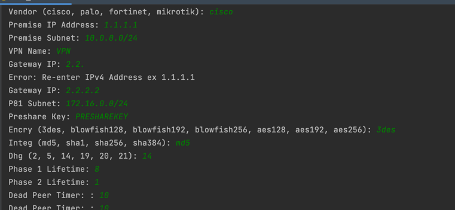

Configuration Samples for Perimeter81 Internal to various other vendor devices. 
This is used to help offer configuration samples on the various vendors but not use at your own discretion. 


# ipsec config builder
This is a configuration repository to help build ipsec & bgp configuration for common firewall & device platforms 
and some basic commands to troubleshoot issues.

The configuration is for route based VPN solutions , IKEV2 Builds

## How to build configuration 
The configuration can be built with a guided script glue_scripts/vars_builder.py. This file will prompt the user for 
questions and ensure compliance to complete builds with needed variables, generate the file to produce the cli config. 

```commandline
python3 vars_builder.py
```
This will allow users to reenter incorrect values with a helpful prompt. 



This script will prompt the users for values for the IPSEC Tunnel and Optional HA Tunnel / BGP Configuration. 
The script will have several default values that are based on the default values in the Perimeter81 builds. 

The final output will be printed to the screen but also 
- The variables file can be found under the vendor name in  `device_vars` . 
- The configuration file will be found under the vendor name in `sample_config` .


### vendor_templates 
is the directory of all the vendors. each subdirectory refernces 
the platform and contains one file to build a base ipsec tunnel with generic firewall permission. There is
a second file for bgp configuration for multi-site tunnels
- mikrotik 
- palo alto
- fortinet 
- cisco

### device_vars
Sample Variable directory that contains the specific variables to each build 
along with the references in the jinja2 build 

There is unique variable constraints so please make sure you review the chart 
for vendor to ensure you are complaint to produce functional config.


### sample_config
This is the rendered output when the jinja2 and the yaml files are composed to produce function 
configuration per platform

### vendor_cmds
This is a directory of troubleshooting & informational gathering commands 

